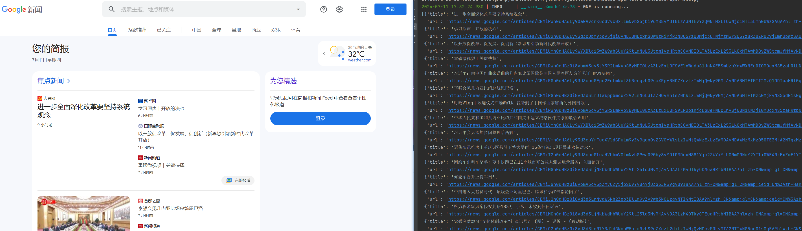
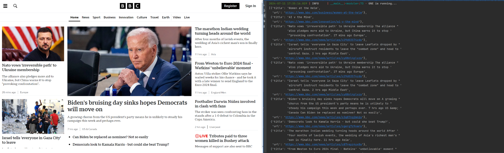
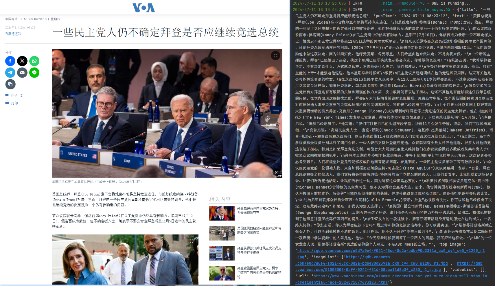

# INSTRUCTION
本项目通过总结常见国内外新闻网站页面规则，总结了一些通用的解析方法，在开发时间中效果较好，且用法简单

## 解析字段如下：
### 1.新闻列表页
- 新闻url
- 新闻标题

### 2.新闻内容提取 
- 文章标题
- 文章发布时间
- 文章内容
- 文章主图片
- 文章图片
- 文章视频
- 网站名称
- 网站logo
- 网站域名

# 效果演示





# USAGE
本项目提供两种用法：
1. url模式: 传参为url。需要安装playwright, 以及根据提示playwright install安装浏览器内核。通过浏览器下载完整html.
2. html模式: 传参为url以及html。此时GNS将不做任何网络请求，url的作用仅做为网站logo以及媒体文件url拼接。

解析文章列表页
```python
from GeneralNewsScraper import GNS

_html = """ html示例 """
articles = GNS.article_list(url="https://www.voachinese.com/", html=_html)
print(articles)

```

解析文章详情页
```python
from GeneralNewsScraper import GNS

_html = """ html示例 """
articles = GNS.article(url="https://www.voachinese.com/a/exiled-chinese-businessman-guo-s-trial-nears-close/7693596.html", html=_html)
print(articles)

```
有问题请联系：jinchenghz@foxmail.com

### 免责声明：本项目仅供学习参考，请勿用于非法用途，否则后果自负。